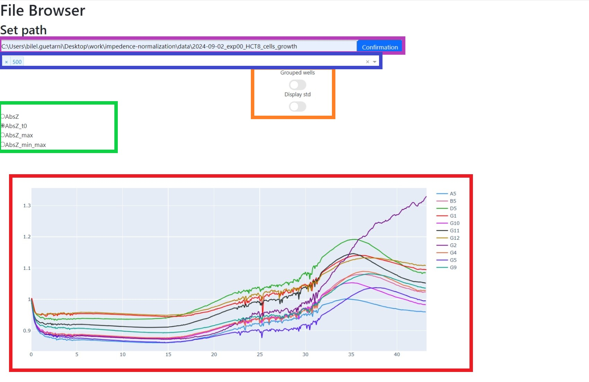

## Lancement de l'interface

Dans le dossier `app` se trouve un fichier `app.bat`. Exécutez ce fichier (double-clique) afin de lancer l'application. Un nouvel onglet s'ouvre dans le navigateur par défaut de l'ordinateur avec l'URL `http://127.0.0.1:8050/`. Cette URL, ainsi que le port, peuvent être modifiés dans le script `app.py` se trouvant dans le dossier `app`.

Dans la barre en dessous de ***Set path*** (encadré violet ci-dessous), entrez le chemin du dossier contenant les données de tous les puits (sans guillemets et séparé par le caractère **\\**).

Lorsqu'un dossier contenant des données expérimentales est sélectionné pour la première fois, les données du dossier sont collectées et enregistrées dans un fichier .CSV situé dans le dossier `app/csv`. Lorsque ce dossier sera entré à nouveau plus tard, ce fichier CSV sera utilisé afin de ne pas avoir à collecter les données à noueau.

**Note** : le fichier CSV porte le même nom que le dossier ; si deux dossiers portent le même nom, alors le fichier risque d'être réutilisé pour la mauvaise expérimentation.

## Utilisation de l'interface

Une fois le fichier CSV créé, une barre de sélection de fréquence apparaît (encadré bleu), ce qui permet de sélectionner une ou plusieurs fréquences. Dans le cas où une seule fréquence est sélectionnée, les données sont affichées sur un plan 2D, et dans le cas de plusieurs fréquences, un affichage 3D permet de visualiser les différentes fréquences sur l'axe *y*.

Une fonctionnalité de regroupements de puits en groupe est disponible via les switchs (encadré orange). Le premier (*Grouped wells*) permet de regrouper les puits, et le second (*Display std*) permet d'afficher la variance sous forme de barres d'erreurs.

Dans l'encadré vert, différentes méthodes de normalisation sont disponibles :

* *AbsZ* affiche les valeurs d'impédances brut.
* *AbsZ_t0* normalise les valeurs par celle à t=0.
* *AbsZ_max* normalise les valeurs par la valeur maximum.
* *AbsZ_min_max* normalise les valeurs entre 0 et 1.

## TODO

* Ajouter une option de regroupement de puits en groupe.
* Retirer *std slidebar* lorsque les puits ne sont pas regroupés.
* Enregistrer le graphe 3D en PNG avec la même orientation que sur l'interface.
* Améliorer l'érgonomie de l'interface.
