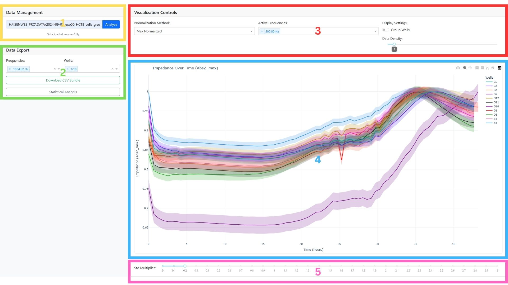
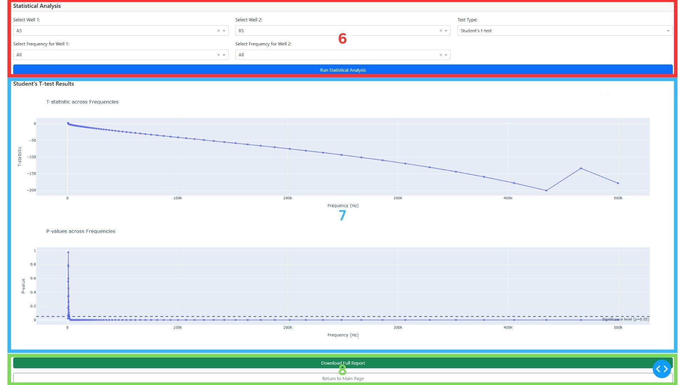

## Installation

Pour installer l'outil sur votre ordinateur, il vous suffit de télécharger le code en format ZIP, et de le dézipper sur votre ordinateur. Pour celà, cliquez sur le boutton vert nommé **Code** et sélectionnez **Download ZIP**.

## Lancement de l'interface

Dans le dossier `executable` se trouve un fichier `app.exe`. Exécutez ce fichier (double-clique) afin de lancer l'application. 
Un nouvel onglet s'ouvre dans le navigateur par défaut de l'ordinateur avec l'URL `http://127.0.0.1:8050/`.

Lorsqu'un dossier contenant des données expérimentales est sélectionné pour la première fois, les données du dossier sont collectées et enregistrées dans un fichier .CSV situé dans le dossier `app/analysis_results`. Lorsque ce dossier sera entré à nouveau plus tard, ce fichier CSV sera utilisé afin de ne pas avoir à collecter les données à nouveau.

**Note** : le fichier CSV porte le même nom que le dossier ; si deux dossiers portent le même nom, alors le fichier risque d'être réutilisé pour la mauvaise expérimentation.

## Utilisation de l'interface

Une fois le fichier CSV créé, les graphiques s'afficheront.
1. Permet d'écrire le chemin vers le dossier à analyser.
2. Permet de télécharger les résultats en choisissant certains puits et certaines fréquences. Permet de diriger sur la page d'analyse statistique.
3. Contient toutes les options de visualisation (Data density permet de réduire le nombre de points à afficher sur le graphe).
4. Visualisation des courbes d'impédance.
5. Permet de réduire/augmenter la visualisation des std.

6. Permet de choisir quels puits seront comparés, à quelle(s) fréquence(s) et avec quel test.
7. Visualisation des résultats.
8. Permet de télécharger un compte-rendu du test et de retourner à la page d'accueil.

## TODO

* Implémenter le regroupement
* Implémenter les 2 nouvelles normalisations
* Améliorer la visualisation 3D
* Ajouter des options de personnalisation
* Enregistrer le graphe 3D en PNG avec la même orientation que sur l'interface.